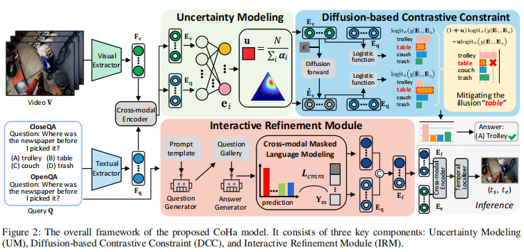
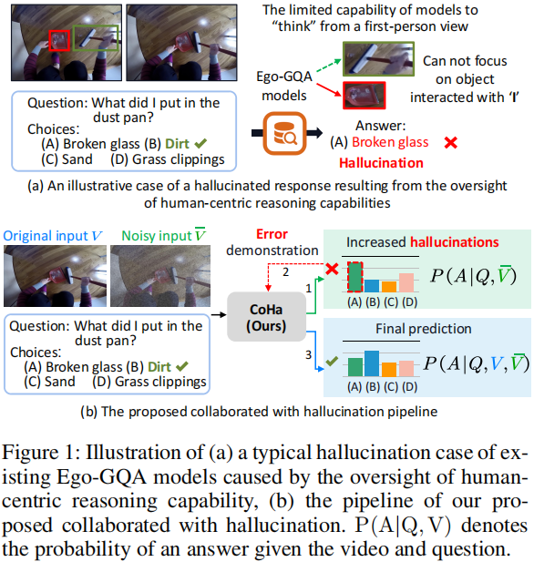
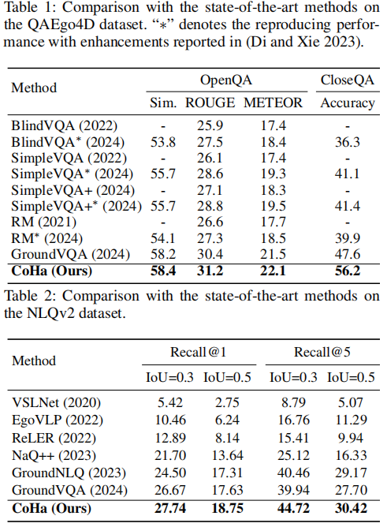
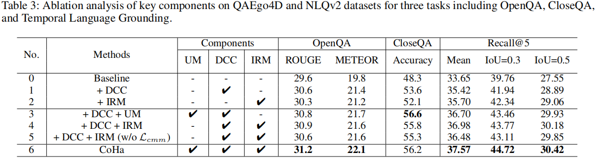
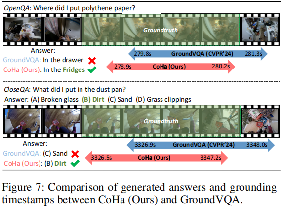

## Introduction
This is the source code of "Collaborated with Hallucination: Enhancing Egocentric Grounded Question Answering via Error Demonstrations". 

## Collaborated with Hallucination: Enhancing Egocentric Grounded Question Answering via Error Demonstrations
The CoHa model is structured with three integral components:

1) **Uncertainty Modeling (UM):** This component employs the Subjective Logic theory to model the unreliability degree of generated responses, which enables the model to assess the extent of penalty for improper answers.

2) **Diffusion-based Contrastive Constraint (DCC):** Designed to assign reasonable restraint to mitigate hallucinations according to uncertainty.

3) **Interactive Refinement Module (IRM):** Focused on adding more fine-grained
cues observed from the first-person view.




## Proposed Model (CoHa)
* Uncertainty Modeling (UM)
* Diffusion-based Contrastive Constraint (DCC)
* Interactive Refinement Module (IRM)


## Motivation

Compared with the widely used third-person view datasets on the Internet, the egocentric datasets are recorded in the first-person view. However, demonstrated by Egothink, existing Ego-GQA methods often treat video understanding from first-person and third-person views equivalently, neglecting the critical role of human-centric reasoning in egocentric contexts. This oversight leads to the model being more susceptible to hallucinations during the understanding of egocentric videos, whereby the model inaccurately focuses on objects or actions being interacted with by the subject.

## Results


## Ablation Study on QAEgo4D and NLQv2


## Grounding and QA Examples



## Usage
* Training
```python
CUDA_VISIBLE_DEVICES=0,1,2,3 python run.py \
    model=MILU \
    'dataset.qa_train_splits=[QaEgo4D_train]' \
    dataset.batch_size=4 \
    trainer.gpus=4
```
* Testing
```python
CUDA_VISIBLE_DEVICES=0 HYDRA_FULL_ERROR=1 python run.py \
    model=MILU \
    'dataset.qa_train_splits=[QaEgo4D_train]' \
    'dataset.test_splits=[QaEgo4D_test]' \
    dataset.batch_size=8 \
    +trainer.test_only=True \
    '+trainer.checkpoint_path="./"'
```

